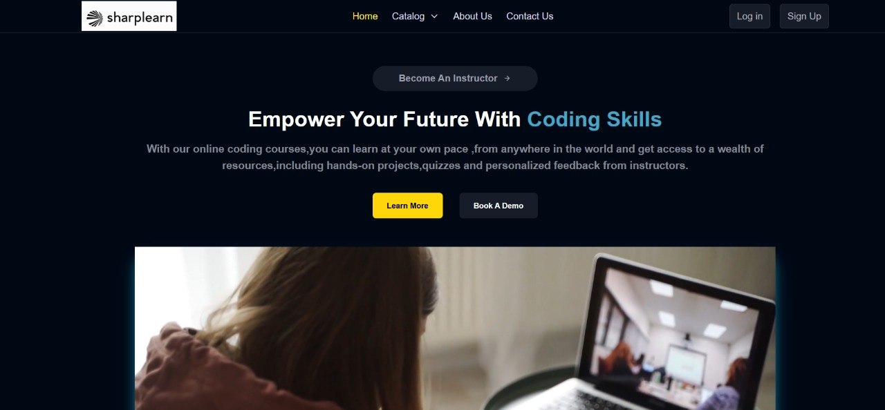

# SharpLearn Online Education Platform (MERN App)

## Project Description

SharpLearn is a modern, functional ed-tech platform that enables users to create, consume, and rate educational content. Built with the MERN stack (MongoDB, ExpressJS, ReactJS, NodeJS), SharpLearn provides:

- A seamless and interactive learning experience for students, making education more accessible and engaging.
- A platform for instructors to showcase their expertise and connect with learners worldwide.

This document covers:

1. System architecture
2. Front-end and back-end features
3. API design
4. Deployment and testing
5. Future enhancements

## System Architecture

SharpLearn consists of three main components: the front end, the back end, and the database. The platform follows a client-server architecture, with the front end as the client and the back end/database as the server.

### Front-end

- Built with ReactJS for dynamic, responsive UIs
- Communicates with the backend via RESTful APIs
- Uses Redux for state management
- Styled with CSS and Tailwind CSS

### Back-end

- Built with NodeJS and ExpressJS
- Provides RESTful APIs for all platform features
- Handles authentication, course management, payments, and media processing

### Database

- MongoDB for flexible, scalable data storage
- Stores user data, course content, and platform information

### Architecture Diagram

## Features

### For Students

- Homepage with platform overview
- Course catalog with descriptions and ratings
- Wishlist and cart management
- Course content access (videos, materials)
- Profile management

### For Instructors

- Dashboard with course analytics
- Course creation and management
- Profile and account management

### For Admin (Future Scope)

- Platform analytics dashboard
- User and instructor management
- Course and revenue insights

## Back End Details

- Monolithic Node.js/Express.js architecture
- MongoDB as the primary database
- JWT for authentication and authorization
- Bcrypt for password hashing
- Mongoose for MongoDB object modeling
- Cloudinary for media management
- Razorpay for payment integration

### Data Models

- User (student/instructor): name, email, password, courses, etc.
- Course: name, description, instructor, media, etc.
- Additional models for sections, reviews, progress, etc.

## API Design

SharpLearn's API follows REST principles, using JSON for data exchange and standard HTTP methods (GET, POST, PUT, DELETE).

**Sample Endpoints:**

- `POST /api/auth/signup` – Register a new user
- `POST /api/auth/login` – User login and JWT generation
- `POST /api/auth/verify-otp` – OTP verification
- `POST /api/auth/forgot-password` – Password reset
- `GET /api/courses` – List all courses
- `GET /api/courses/:id` – Get course details
- `POST /api/courses` – Create a course
- `PUT /api/courses/:id` – Update a course
- `DELETE /api/courses/:id` – Delete a course
- `POST /api/courses/:id/rate` – Rate a course

## Deployment & Testing

- Frontend and backend can be deployed separately (e.g., Vercel, Heroku, AWS)
- Environment variables for sensitive data
- Testing with Jest, React Testing Library, and Postman

## Future Enhancements

- Admin dashboard and advanced analytics
- Enhanced course recommendation engine
- Mobile app version
- More payment gateways
- Real-time chat and Q&A features

---

**SharpLearn** is designed to provide an immersive learning experience for students and a robust platform for instructors. For more details, refer to the codebase and documentation.
